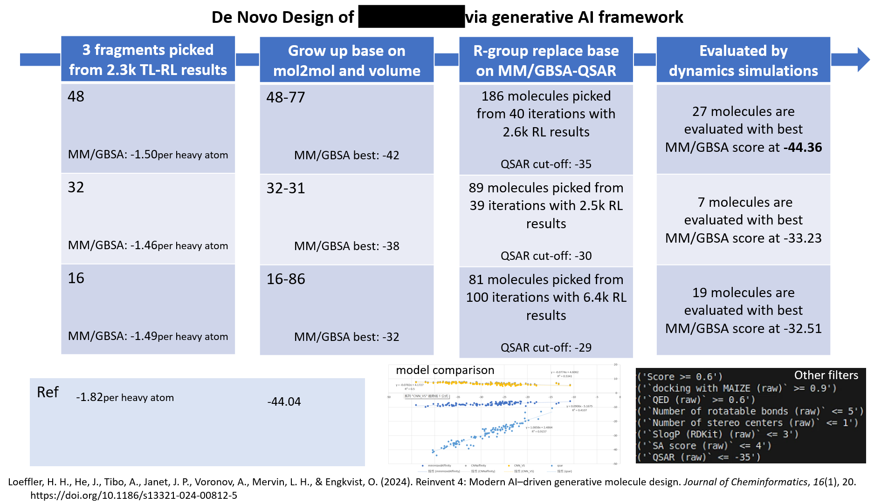
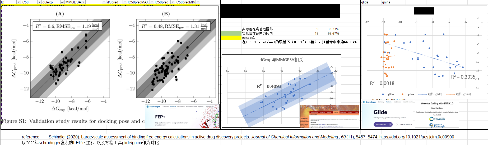

# Irrelevant-Manual  

Things I do at working:  

## reinvent  
molecule generation  
https://github.com/MolecularAI/REINVENT4

## amber  
molecular dynamics simulations   
https://github.com/pablo-arantes/making-it-rain  
https://ambermd.org/AmberTools.php  
https://openmm.org/

## TIES
relative binding free energy perturbation calculation   
https://github.com/UCL-CCS/TIES  
https://github.com/UCL-CCS/TIES_MD  
https://github.com/pablo-arantes/making-it-rain  
https://ambermd.org/AmberTools.php  

## boltz  
structural prediction  
https://github.com/jwohlwend/boltz  

## rosetta  
protein-protein docking  
https://docs.rosettacommons.org/docs/latest/Home  
https://meilerlab.org/rosetta-workshop-2022/

## aizynthfinder  
retrosynthetic analysis  
https://github.com/MolecularAI/aizynthfinder

## DEL  
screening data analysis  

## Examples  
   

  

