# PROTAC 三元复合物建模流程

## 完整流程图

```mermaid
graph TB
    subgraph "准备阶段"
        A1[CBN.mol2] --> A2[molfile_to_params.py]
        A3[POI.mol2] --> A2
        A2 --> A4[CBN.params + POI.params]
        A5[PP.pdb] --> A6[cat PP.pdb + CBN.pdb + POI.pdb]
        A4 --> A6
        A6 --> A7[PPP.pdb]
    end

    subgraph "蛋白-蛋白对接 (Rosetta)"
        B1[PPP.pdb] --> B2[docking_prepack_protocol]
        B2 --> B3[TER.pdb]
        B3 --> B4[docking_protocol<br/>4096个构象]
        B4 --> B5[TER_*.pdb + score.sc]
        B5 --> B6[calc_cbn_poi_distance.py<br/>距离过滤]
        B6 --> B7[ppd/*.pdb]
    end

    subgraph "批量优化流水线 (batch_pipeline.sh)"
        C1[ppd/*.pdb + linkers/*.mae] --> C2[并行调度<br/>PDB × MAE 组合]
        
        C2 --> C3[阶段1: pipeline.py<br/>Schrödinger + RDKit]
        C3 --> C3a[提取CBN/POI]
        C3a --> C3b[prepwizard修复]
        C3b --> C3c[linker对齐]
        C3c --> C3d[扭转优化]
        C3d --> C3e[*_refined.pdb]
        
        C3e --> C4[阶段2: ternary_modify]
        C4 --> C4a[提取配体坐标]
        C4a --> C4b[PDB→MOL2→params]
        C4b --> C4c[坐标替换]
        C4c --> C4d[*_refine_mod.pdb<br/>+ *.params]
        
        C4d --> C5[阶段3: extract_chain]
        C5 --> C5a[PyMOL提取C链]
        C5a --> C5b[残基重编号]
        C5b --> C5c[pdbfixer补全<br/>缺失残基]
        C5c --> C5d[合并回原结构]
        C5d --> C5e[loop/*_mod_loop.pdb]
        
        C5e --> C6[阶段4: minimize_ppi]
        C6 --> C6a[Rosetta MPI<br/>能量最小化]
        C6a --> C6b[mini/mini_*_mod_loop.pdb<br/>+ *_score.sc]
    end

    subgraph "结果汇总"
        D1[所有任务完成] --> D2[extract_summary]
        D2 --> D3[summary.csv<br/>Final_Score, Backbone_RMS<br/>Ligand_RMSD, Best_Energy]
    end

    A7 --> B1
    B7 --> C1
    C6b --> D1

    style A1 fill:#e1f5ff
    style A3 fill:#e1f5ff
    style A7 fill:#fff4e1
    style B7 fill:#fff4e1
    style C3e fill:#e8f5e9
    style C4d fill:#e8f5e9
    style C5e fill:#e8f5e9
    style C6b fill:#e8f5e9
    style D3 fill:#fce4ec
```



## 流水线详细架构

```
┌─────────────────────────────────────────────────────────────────────────┐
│                    PROTAC Ternary 完整建模流程                           │
├─────────────────────────────────────────────────────────────────────────┤
│                                                                          │
│  ┌──────────────────────────────────────────────────────────────────┐   │
│  │  蛋白-蛋白对接 (Rosetta)                                        │   │
│  │  ┌────────────────────────────────────────────────────────────┐ │   │
│  │  │ 准备阶段                                                    │ │   │
│  │  │   • molfile_to_params.py: CBN.mol2/POI.mol2 → params       │ │   │
│  │  │   • cat PP.pdb + CBN.pdb + POI.pdb → PPP.pdb               │ │   │
│  │  └────────────────────────────────────────────────────────────┘ │   │
│  │                          ↓                                      │   │
│  │  ┌────────────────────────────────────────────────────────────┐ │   │
│  │  │ 预打包 (docking_prepack_protocol)                          │ │   │
│  │  │   • 优化侧链包装                                           │ │   │
│  │  │   • PPP.pdb → TER.pdb                                      │ │   │
│  │  └────────────────────────────────────────────────────────────┘ │   │
│  │                          ↓                                      │   │
│  │  ┌────────────────────────────────────────────────────────────┐ │   │
│  │  │ 对接 (docking_protocol, mpirun -np 64)                     │ │   │
│  │  │   • 生成 4096 个构象                                       │ │   │
│  │  │   • partners BX_CY, dock_pert 5 20                         │ │   │
│  │  │   • 输出: TER_*.pdb + score.sc                             │ │   │
│  │  └────────────────────────────────────────────────────────────┘ │   │
│  │                          ↓                                      │   │
│  │  ┌────────────────────────────────────────────────────────────┐ │   │
│  │  │ 过滤 (calc_cbn_poi_distance.py)                            │ │   │
│  │  │   • 计算 CBN-POI 距离                                      │ │   │
│  │  │   • 输出: ppd/*.pdb                                        │ │   │
│  │  └────────────────────────────────────────────────────────────┘ │   │
│  └──────────────────────────────────────────────────────────────────┘   │
│                                                                          │
│  ┌──────────────────────────────────────────────────────────────────┐   │
│  │  批量优化流水线 (batch_pipeline.sh)                               │   │
│  │  输入: ppd/*.pdb (N个) × linkers/*.mae (M个) → N×M 个任务并行   │   │
│  │                                                                  │   │
│  │  ┌────────────────────────────────────────────────────────────┐ │   │
│  │  │  任务池 (恒定 N 并发)                                      │ │   │
│  │  │  ┌─────────┐ ┌─────────┐ ┌─────────┐    ┌─────────┐      │ │   │
│  │  │  │ Task 1  │ │ Task 2  │ │ Task 3  │... │ Task N  │      │ │   │
│  │  │  └────┬────┘ └────┬────┘ └────┬────┘    └────┬────┘      │ │   │
│  │  └───────┼───────────┼───────────┼──────────────┼───────────┘ │   │
│  │          │           │           │              │              │   │
│  │          ▼           ▼           ▼              ▼              │   │
│  │  ┌─────────────────────────────────────────────────────────┐   │   │
│  │  │  每个任务执行 4 个阶段 (串行)                            │   │   │
│  │  │  ┌──────────────────────────────────────────────────┐   │   │   │
│  │  │  │ 阶段1: pipeline.py (openfe_env)                  │   │   │   │
│  │  │  │   • 提取 CBN/POI → prepwizard修复                │   │   │   │
│  │  │  │   • linker对齐 → RDKit扭转优化                   │   │   │   │
│  │  │  │   输出: *_refined.pdb                            │   │   │   │
│  │  │  └──────────────────────────────────────────────────┘   │   │   │
│  │  │                          ↓                               │   │   │
│  │  │  ┌──────────────────────────────────────────────────┐   │   │   │
│  │  │  │ 阶段2: single_ternary_modify.sh (py26)           │   │   │   │
│  │  │  │   • 提取配体坐标 → PDB→MOL2→params               │   │   │   │
│  │  │  │   • 用新配体替换原结构                           │   │   │   │
│  │  │  │   输出: *_refine_mod.pdb + *.params              │   │   │   │
│  │  │  └──────────────────────────────────────────────────┘   │   │   │
│  │  │                          ↓                               │   │   │
│  │  │  ┌──────────────────────────────────────────────────┐   │   │   │
│  │  │  │ 阶段3: single_extract_chain.sh (base+openfe_env) │   │   │   │
│  │  │  │   • PyMOL提取C链 → 重编号                        │   │   │   │
│  │  │  │   • pdbfixer补全缺失残基 → 合并回原结构          │   │   │   │
│  │  │  │   输出: loop/*_mod_loop.pdb                      │   │   │   │
│  │  │  └──────────────────────────────────────────────────┘   │   │   │
│  │  │                          ↓                               │   │   │
│  │  │  ┌──────────────────────────────────────────────────┐   │   │   │
│  │  │  │ 阶段4: minimize_ppi (Rosetta MPI)                │   │   │   │
│  │  │  │   • 全原子能量最小化                             │   │   │   │
│  │  │  │   • 优化蛋白-蛋白/蛋白-配体界面                  │   │   │   │
│  │  │  │   输出: mini/mini_*_mod_loop.pdb + *_score.sc    │   │   │   │
│  │  │  └──────────────────────────────────────────────────┘   │   │   │
│  │  └─────────────────────────────────────────────────────────┘   │   │
│  └──────────────────────────────────────────────────────────────────┘   │
│                                                                          │
│  ┌──────────────────────────────────────────────────────────────────┐   │
│  │  结果汇总                                                        │   │
│  │   • outputs/{MAE}/ 目录结构                                      │   │
│  │   • summary.csv (Final_Score, Backbone_RMS, Ligand_RMSD, Energy) │   │
│  └──────────────────────────────────────────────────────────────────┘   │
└─────────────────────────────────────────────────────────────────────────┘
```

## 特性

- **并行调度**: 恒定 N 并发 (后台进程池)
- **断点恢复**: 检查输出文件，已完成的阶段自动跳过
- **错误容忍**: 单阶段失败不影响其他任务
- **详细日志**: `.batch_logs/{MAE}/{PDB}.log`
- **结果汇总**: 自动生成 `summary.csv`

---

## 一、准备阶段


### 1.1 生成小分子参数文件

```bash
# CBN (分子胶) 参数生成
$ROSETTA/main/source/scripts/python/public/molfile_to_params.py \
    CBN.mol2 -n CBN -p CBN --conformers-in-one-file --chain=X

# POI (靶蛋白配体) 参数生成
$ROSETTA/main/source/scripts/python/public/molfile_to_params.py \
    POI.mol2 -n POI -p POI --conformers-in-one-file --chain=Y

# 删除params文件最后一行（避免冲突）
sed -i '$ d' CBN.params
sed -i '$ d' POI.params
```

**输入**: `CBN.mol2`, `POI.mol2`  
**输出**: `CBN.params`, `CBN.pdb`, `POI.params`, `POI.pdb`

### 1.2 合并初始结构

```bash
# 合并蛋白-蛋白复合物和小分子
cat PP.pdb CBN.pdb POI.pdb > PPP.pdb
```

**输入**: `PP.pdb` (蛋白复合物), `CBN.pdb`, `POI.pdb`  
**输出**: `PPP.pdb` (完整初始结构)

---

## 二、蛋白-蛋白对接 (Rosetta)

### 2.1 预打包协议

```bash
$ROSETTA_BIN/docking_prepack_protocol.mpi.linuxgccrelease \
    -s PPP.pdb \
    -use_input_sc \
    -extra_res_fa CBN.params POI.params
```

**作用**: 优化侧链包装，为对接做准备  
**输出**: `PPP_0001.pdb` → 重命名为 `TER.pdb`

### 2.2 对接协议

```bash
mpirun -np 64 $ROSETTA_BIN/docking_protocol.mpi.linuxgccrelease \
    -s TER.pdb \
    -nstruct 4096 \
    -use_input_sc \
    -spin \
    -dock_pert 5 20 \
    -partners BX_CY \
    -ex1 -ex2aro \
    -load_PDB_components false \
    -extra_res_fa CBN.params POI.params \
    -out:file:scorefile score.sc \
    -score:docking_interface_score
```

**关键参数**:
- `-nstruct 4096`: 生成 4096 个对接构象
- `-partners BX_CY`: 定义对接 partners (链 B-X 和 C-Y)
- `-dock_pert 5 20`: 扰动参数 (平移 5Å, 旋转 20°)
- `-ex1 -ex2aro`: 使用额外的旋转异构体库

**输出**: `TER_*.pdb` (4096 个对接构象), `score.sc` (评分文件)

### 2.3 整理输出

```bash
mkdir ppd
mv TER_*.pdb ppd
python calc_cbn_poi_distance.py  # 计算 CBN-POI 距离过滤
```

---

## 三、批量优化流水线 (batch_pipeline.sh)

### 使用方法

```bash
cd build
./batch_pipeline.sh [并发数] [PDB目录] [MAE目录] [输出目录]

# 示例
./batch_pipeline.sh 64 ../ppd ../linkers ../outputs
```

### 3.1 阶段1: 配体优化 (pipeline.py)

**环境**: `openfe_env` (Schrödinger + RDKit)

**流程**:
1. 从 PDB 中提取 CBN/POI 坐标
2. Schrödinger prepwizard 修复 (加氢、质子化状态)
3. 转换为 SDF 格式
4. 与 linker MAE 文件对齐
5. RDKit 扭转优化 + 构象采样
6. 嵌入回 PDB 结构

**输入**: 
- `ppd/TER_XXXX.pdb` (对接构象)
- `linkers/DY-XXXX.mae` (linker 结构)

**输出**: `{PDB}_refined.pdb` (优化后的配体坐标)

### 3.2 阶段2: 坐标替换 (single_ternary_modify.sh)

**环境**: `py26` (Python 2.6) + Open Babel

**流程**:
1. 提取优化后的配体坐标 (HETATM)
2. PDB → MOL2 转换 (Open Babel)
3. MOL2 → Rosetta params 转换 (mol2params)
4. 用新配体坐标替换原结构中的配体

**输入**: `{PDB}_refined.pdb`  
**输出**: 
- `{PDB}_refine_mod.pdb` (替换后的完整结构)
- `{PDB}_refined.params` (Rosetta 配体参数)

### 3.3 阶段3: 链提取与补全 (single_extract_chain.sh)

**环境**: `base` (PyMOL) + `openfe_env` (pdbfixer)

**流程**:
1. PyMOL 提取 C 链 (PROTAC 链)
2. 残基重新编号
3. pdbfixer 补全缺失残基
   - 默认补全: `{(0, 210): ['SER', 'VAL', 'ASP', 'PHE', 'PRO', 'GLU']}`
   - 可通过环境变量 `MISSING_RESIDUES` 自定义
4. 将补全后的链合并回原结构

**输入**: `{PDB}_refine_mod.pdb`  
**输出**: `loop/{PDB}_mod_loop.pdb` (补全后的结构)

### 3.4 阶段4: 能量最小化 (minimize_ppi)

**环境**: Rosetta MPI

**流程**:
1. 在 `mini/` 目录中运行 Rosetta
2. 全原子能量最小化
3. 优化蛋白-蛋白和蛋白-配体界面

**命令**:
```bash
cd mini/
$ROSETTA_BIN/minimize_ppi.mpi.linuxgccrelease \
    -s ../loop/{PDB}_mod_loop.pdb \
    -extra_res_fa ../{PDB}_refined.params \
    -jump_all \
    -out:file:scorefile {PDB}_score.sc
```

**输入**: `loop/{PDB}_mod_loop.pdb`, `{PDB}_refined.params`  
**输出**: 
- `mini/mini_{PDB}_mod_loop.pdb` (最小化后的结构)
- `mini/{PDB}_score.sc` (评分文件)

---

## 四、输出结构

```
outputs/{MAE_NAME}/
├── {PDB}_refined.pdb          # 阶段1: 优化后的配体坐标
├── {PDB}_refine_mod.pdb       # 阶段2: 坐标替换后的结构
├── {PDB}_refined.params       # 阶段2: Rosetta 配体参数
├── loop/
│   └── {PDB}_mod_loop.pdb     # 阶段3: 链补全后的结构
└── mini/
    ├── mini_{PDB}_mod_loop.pdb # 阶段4: 最终最小化结构
    └── {PDB}_score.sc         # 阶段4: 评分文件
```

---

## 五、特性与容错

### 5.1 并行调度
- 恒定 N 并发 (后台进程池)
- 默认 64 并发，可根据 CPU 核数调整

### 5.2 断点恢复
- 检查各阶段输出文件是否存在
- 已完成的阶段自动跳过
- 中断后重新运行可从断点继续

### 5.3 错误处理
- 单阶段失败不影响其他任务
- 详细日志记录到 `.batch_logs/{MAE}/{PDB}.log`
- 最终汇总各阶段成功/失败统计

### 5.4 结果汇总
- 自动生成 `summary.csv`
- 提取关键参数:
  - `Final_Score`: Rosetta 最终能量
  - `Backbone_RMS`: 骨架 RMSD
  - `Ligand_RMSD`: 配体 RMSD
  - `Best_Energy_kJ`: 最佳构象能量

---

## 六、环境变量

```bash
# 可选配置 (有默认值)
export BABEL=/path/to/obabel
export MOL2PARAMS=/path/to/molfile_to_params.py
export ROSETTA=/path/to/rosetta
export MISSING_RESIDUES="{(0, 210): ['SER', 'VAL', 'ASP', 'PHE', 'PRO', 'GLU']}"
```

---

## 七、完整执行示例

```bash
# 1. 准备阶段
cd /path/to/project
# (执行 command.txt 中的准备命令)

# 2. 蛋白-蛋白对接
$ROSETTA_BIN/docking_prepack_protocol.mpi.linuxgccrelease \
    -s PPP.pdb -use_input_sc -extra_res_fa CBN.params POI.params
mv PPP_0001.pdb TER.pdb

mpirun -np 64 $ROSETTA_BIN/docking_protocol.mpi.linuxgccrelease \
    -s TER.pdb -nstruct 4096 -use_input_sc -spin \
    -dock_pert 5 20 -partners BX_CY -ex1 -ex2aro \
    -load_PDB_components false \
    -extra_res_fa CBN.params POI.params \
    -out:file:scorefile score.sc

mkdir ppd
mv TER_*.pdb ppd

# 3. 批量优化流水线
cd build
./batch_pipeline.sh 64 ../ppd ../linkers ../outputs

# 4. 查看结果
cat ../outputs/summary.csv
```

---

## 八、监控与调试

```bash
# 实时监控日志
tail -f outputs/.batch_logs/DY-0417/TER_0001.log

# 查看运行状态
ps aux | grep batch_pipeline

# 检查失败任务
grep -r "STAGE.*_FAIL" build/.batch_status_*
```
